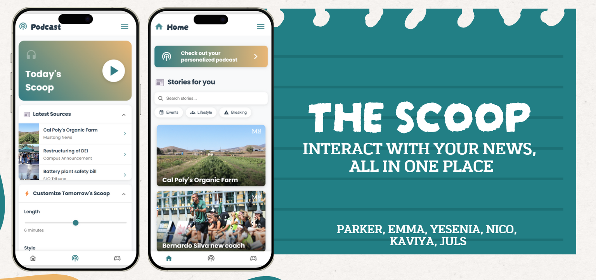

# The Scoop
## Stay Informed, The Smart Way

Welcome to **The Scoop** – a proof-of-concept mobile app built to connect Cal Poly students with campus announcements, local news, and community updates all in one place. Born at Camp Poly Hacks, I built this app in just 36 hours as the sole developer, and it clinched first place overall, winning $1000!

---

### What is The Scoop?

The Scoop emerged from the need to streamline the flood of scattered information on campus. Instead of digging through multiple sources for news and updates, this app centralizes everything into a single, easy-to-use platform. One feature I’m particularly proud of is the **interactive podcast summary**—powered by NotebookLM—which generates a personalized overview of your top stories and lets you ask follow-up questions.

This project isn’t just a hackathon win; it’s a glimpse into how smart, centralized news delivery can transform the way students stay connected with their community.

[Watch the full Demo Video on YouTube!](https://youtu.be/qxEid_J4tug?si=PiiN0k9T6W1zS2qQ)

---

### How Does It Work?

I built The Scoop as a React-based application that behaves just like a mobile app. Here’s a quick breakdown:

- **User Preferences:** The app captures your interests to tailor the newsfeed.
- **Content Aggregation:** It pulls in campus announcements and local news from various sources.
- **Interactive Podcast Summary:** Overnight, it batches the day’s articles into a NotebookLM-driven podcast—ready for you to listen to the next morning.

Being the only coder on a team of six, I integrated all these components under tight time constraints, proving that even a small project can pack a big punch when passion meets purpose. Our project was picked to win by a clear margin because the demonstration clearly showed the user-focused thinking and detail-oriented design of our project.

